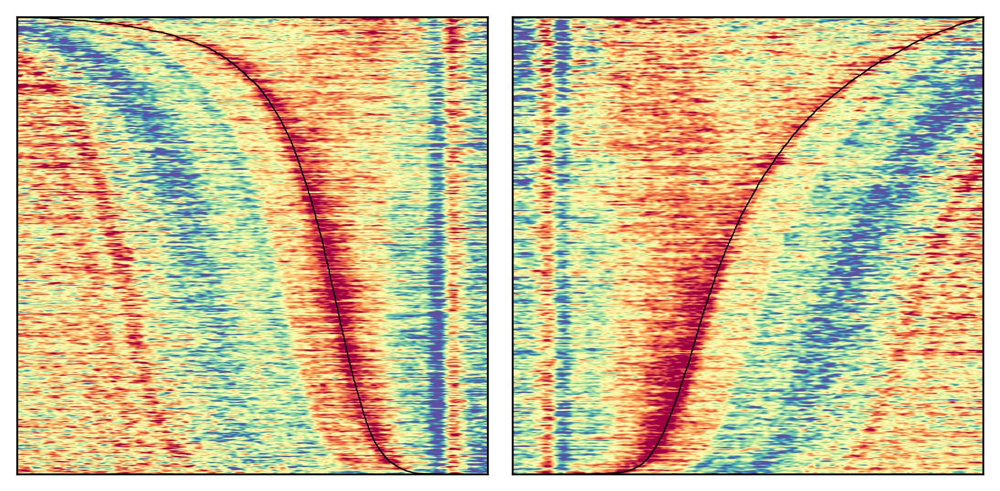

This is the supporting repository for the paper titled **Decision-making components and times revealed by the single-trial electro-encephalogram**



# Structure
All the results and figures are generated by the two notebooks:
- `1-HMP_analyses.ipynb` estimates the HMP model and analyses the by-trial effect of experimental factors on inter-event durations and event topography
- `2-ERP_analyses.ipynb` plots the ERPs and test the presence of the CPP
  
  
> [!Note]
> Running the analyses on the 512Hz EEG data as in the paper would require a computer with a fairly large amount of RAM (64GB)\
> To run it on a regular laptop downsample the data by changing line 25 of the notebook `1-HMP_analyses.ipynb` from `sfreq = info['sfreq'] ` to `sfreq = 100`\

`data` contains all the data used for the code that produces the analyses and the plots (see specific README in `data/`)

`diagnostic_plots` contains plots that represent the individual fits of the Fechner, Linear and Pieron model to all the different durations used in the study (populated by running the notebooks)

`estimation_files` contains temporary data for the analyses

`plots` contains the plots generated to accompany the paper (populated by running the notebooks)

`experiment_code` contains the code that was used for the data collection

`hmp` is a frozen version of the HMP package (see specific README)

# Installation
> [!WARNING]
> Note that this workflow has only been tested on ubuntu 24.04, running it on windows will probably require some adaptations
> (2025-06-13) : The version 1.0.0-b.1 of HMP is not yet on pypi, should this still not be the case by the time you try this code you can download and install HMP from the `devel` [branch](https://github.com/GWeindel/hmp/tree/devel)

To run the workflow the easiest is to type the following on a Linux (maybe mac) machine with python installed (developped under 3.12.5)\
```bash
python -m venv /home/[yourhome]/venv/dec_times
source /home/[yourhome]/venv/dec_times/bin/activate
python -m pip install jupyterlab bambi arviz #not included with hmp
pip install hmp==1.0.0-b.1
jupyter lab
```

If this is not working it is possible to use the `requirements.txt` to reproduce the exact same environment as the one used for the paper:
```bash
python -m venv /home/[yourhome]/venv/dec_times
source /home/[yourhome]/venv/dec_times/bin/activate
python3 -m pip install -r requirements.txt
pip install hmp==1.0.0-b.1
jupyter lab
```
> [!WARNING]
> Note that this workflow has only been tested on ubuntu 24.04, running it on windows will probably require some adaptations


For instructions on how to use HMP see [https://github.com/GWeindel/hmp](https://github.com/GWeindel/hmp).

Feel free to open issues in case problems arise during reproduction
